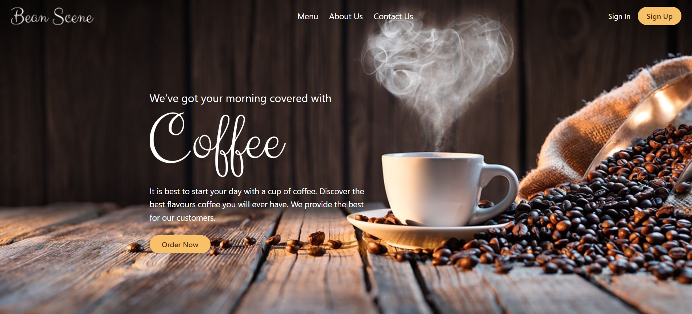
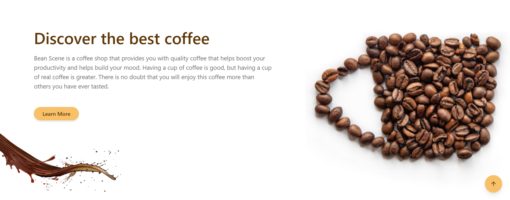
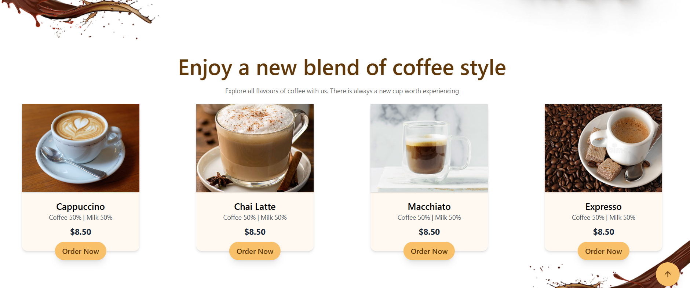
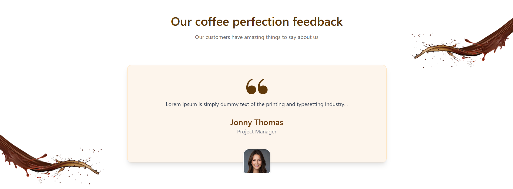
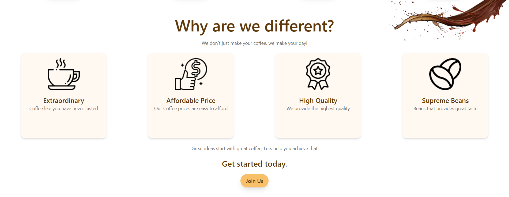
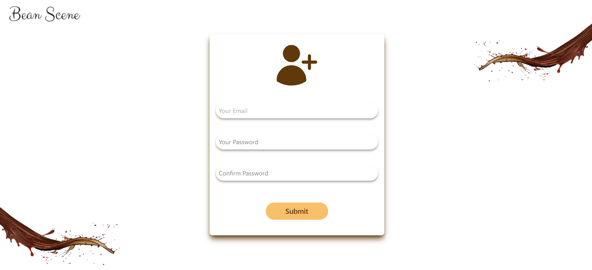
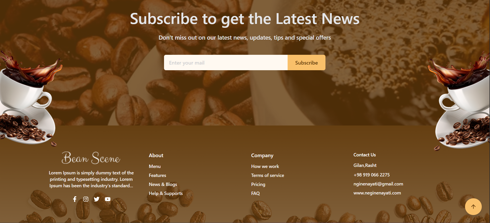

# Bean Scene ☕️

Bean Scene is a modern coffee shop landing page built with **ReactJS**, **Tailwind CSS**, and **Formik**.  
The project includes a clean and responsive design for presenting coffee products, shop features, customer feedback, newsletter subscription, and user authentication actions.

## Preview



## Features

- Modern coffee shop landing page
- Responsive UI design
- Hero section with call-to-action buttons
- About / introduction section
- Features section
- Coffee menu cards
- Promotional banner
- Customer feedback section
- Newsletter subscription form
- Footer with links and contact information
- Form handling with Formik
- Styled with Tailwind CSS

## Tech Stack

- **ReactJS** – Frontend library
- **Tailwind CSS** – Utility-first CSS framework
- **Formik** – Form management
- **JavaScript**
- **HTML5 / CSS3**

## Installation

Clone the repository:

## Main Sections
Hero Section

A full-width coffee-themed hero section with navigation links, authentication buttons, and an order call-to-action.


About Section

Introduces Bean Scene and highlights the quality of the coffee experience.



Features Section

Shows the reasons why Bean Scene is different, including quality, affordability, and premium beans.


Menu Section

Displays different coffee products such as Cappuccino, Chai Latte, Macchiato, and Espresso.



Feedback Section

Includes customer feedback and testimonial design.



Newsletter Section

A subscription form built using Formik for managing form values and submission.



Formik Usage

Formik is used to handle forms such as:

Newsletter subscription
Sign up form
Contact or user input forms





## Responsive Design

The layout is designed to work on different screen sizes using Tailwind CSS utility classes.

- **Future Improvements**
- **Add form validation with formik**
- **Improve accessibility**


```bash
git clone https://github.com/neginen/Coffeeshop

